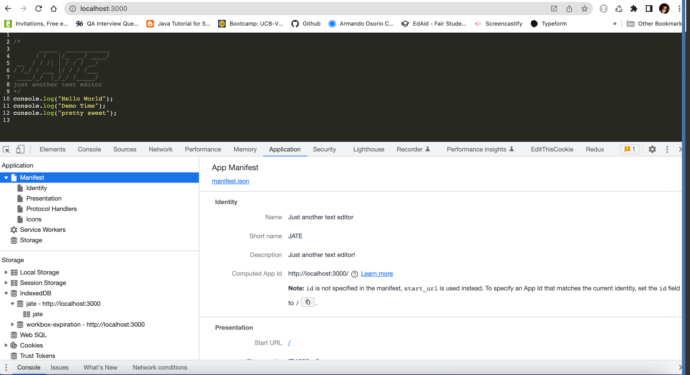
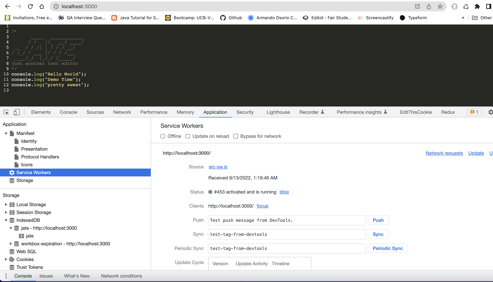
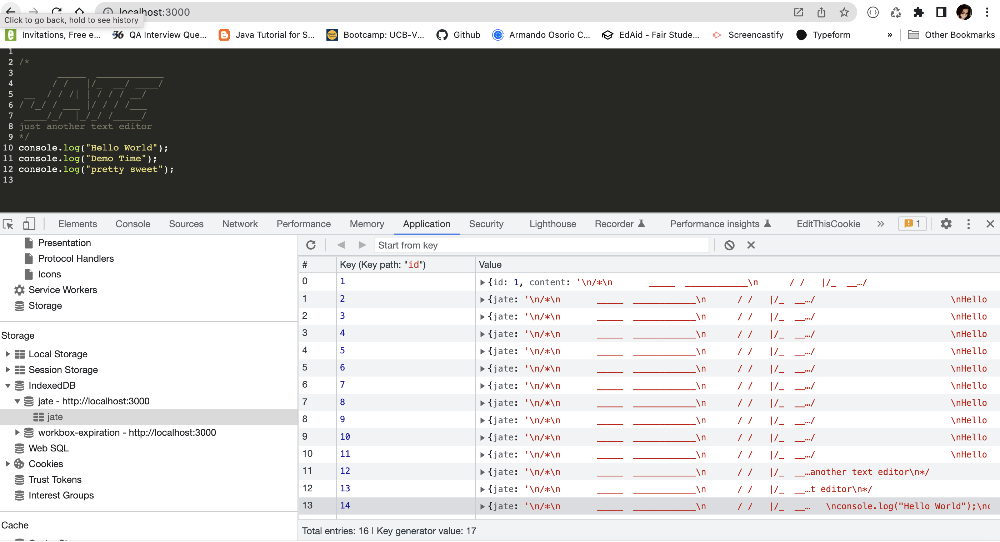

## Description
The app will be a single-page application that meets the PWA criteria. PWAS use the Service Worker and Cache API's to cache assets and API responses, ensuring that the aplication will still continue to work without an internet connection.Service workers
can be used to cache static CSS,Javascript,HTML files, images and even API requests.
We will use webpack and workbox.Workbox is a google library that makes it much easier to set up the service worker.With webpack, we can deliver applications with optimized code called bundles.it also allows to implement CSS loaders to make CSS files more modular.This application should also function offline.

### [Solution URL](https://github.com/ashachakre0906/PWA-Text-Editor)
### [Deploy URL](https://asha-pwa-text-editor.herokuapp.com/)

## Table of Contents
- [Description](#description)
  - [Solution URL](#solution-url)
  - [Deploy URL](#deploy-url)
- [Table of Contents](#table-of-contents)
- [User Story](#user-story)
- [Acceptance Criteria](#acceptance-criteria)
- [Application Demo](#application-demo)
- [Code Examples](#code-examples)
- [Technologies Used](#technologies-used)
- [Credits](#credits)
- [Questions](#questions)


## User Story
```md
AS A developer
I WANT to create notes or code snippets with or without an internet connection
SO THAT I can reliably retrieve them for later use
```

## Acceptance Criteria
```md
GIVEN a text editor web application
WHEN I open my application in my editor
THEN I should see a client server folder structure
WHEN I run `npm run start` from the root directory
THEN I find that my application should start up the backend and serve the client
WHEN I run the text editor application from my terminal
THEN I find that my JavaScript files have been bundled using webpack
WHEN I run my webpack plugins
THEN I find that I have a generated HTML file, service worker, and a manifest file
WHEN I use next-gen JavaScript in my application
THEN I find that the text editor still functions in the browser without errors
WHEN I open the text editor
THEN I find that IndexedDB has immediately created a database storage
WHEN I enter content and subsequently click off of the DOM window
THEN I find that the content in the text editor has been saved with IndexedDB
WHEN I reopen the text editor after closing it
THEN I find that the content in the text editor has been retrieved from our IndexedDB
WHEN I click on the Install button
THEN I download my web application as an icon on my desktop
WHEN I load my web application
THEN I should have a registered service worker using workbox
WHEN I register a service worker
THEN I should have my static assets pre cached upon loading along with subsequent pages and static assets
WHEN I deploy to Heroku
THEN I should have proper build scripts for a webpack application
```

## Application Demo


- The following animation demonstrates the application functionality:
[Screencastify Link](https://watch.screencastify.com/v/0aFqEyzl3Pt23scLBdth)

- The following image shows the application's manifest.json file:


- The following image shows the application's registered service worker:


- The following image shows the applications indexedDB storage:



## Code Examples
***getAll() method will get all the contents from the indexDb database***

```js
export const getDb = async () => {
  const JateDB = await openDB("jate", 1);
  const tx = JateDB.transaction("jate", "readonly");
  const store = tx.objectStore("jate");
  const request = store.getAll();
  const result = await request;
  console.log("get data from the database", result);
};
initdb();
```
***This configuration object needs to be in webpack.config.js which will create a manifest.json file***

```js
      new WebpackPwaManifest({
        fingerprints: false,
        inject: true,
        name: "Just another text editor",
        short_name: "JATE",
        description: "Just another text editor!",
        background_color: "#225ca3",
        theme_color: "#225ca3",
        start_url: "/",
        publicPath: "/",
        icons: [
          {
            src: path.resolve("src/images/logo.png"),
            sizes: [96, 128, 192, 256, 384, 512],
            destination: path.join("assets", "icons"),
          },
        ],
      }),
```

## Technologies Used


## Credits
Thank you all TA's and my classmate Nolan Spence for helping with heroku deployment, caching images and screen flashing issues occuring due to webpack-dev-server.


## Questions
Please reach out to me:<br>
Email Address: chourpagar.asha@gmail.com <br>
Github Repo URL:[GitHub](https://github.com/ashachakre0906)